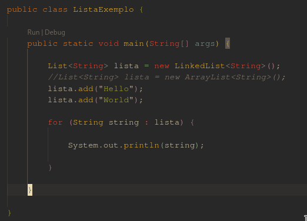

No começo da minha carreira como desenvolvedor de software, nunca me preocupei muito com o bom uso 
dos recursos computacionais. Sempre me pareceu que os computadores tinham sempre todos os recursos
necessários para os sistemas que eu fazia, por mais complexos que fossem. Aprendi da pior maneira 
possível o quanto estava errado. Erros de pilha, estouros de memória e outros problemas bizarros 
foram meus companheiros constantes durante meus primeiros anos de carreira. E tudo isso me fez mudar
o meu modo de programar para melhor.

Um bom gerenciamento de recursos é algo que considero essencial para um bom programador. Naturalmen
te, as linguagens modernas já realizam uma parte do trabalho para você de modo que, podemos programar 
de forma relativamente despreocupada e considerando que sempre teremos "recursos infinitos". Porém, 
é sempre bom conhecermos os conceitos por trás do gerenciamento e tirarmos um melhor proveito
das linguagens de programação, principalmente das mais antigas. Muitos sistemas por aí são legados
ou foram escritos com linguagens onde o gerenciamento dos recursos era controlado principalmente pelo 
desenvolvedor. Se você se deparar com algum destes sistemas no futuro, é melhor estar preparado.

Porém, como fazer este gerenciamento? Me ajudou bastante neste contexto uma filosofia de vida chamada 
minimalismo. Ao contrário do que possa parecer, os minimalistas não buscam viver pobres, sem recursos 
ou passando fome. Um minimalista está sempre em busca do que é realmente necessário para sua vida e 
isso naturalmente passa pelas suas posses. Para alguns, ter uma biblioteca física é fundamental. 
Para outros, um leitor de e-books é o suficiente. Enfim, os minimalistas sempre buscam o que é
*necessário* e deste modo, descobrem que não é necessário muito para viver. É um movimento naturalmente 
oposto ao consumismo, um dos grandes males modernos. 

Diante disso, criei este termo, chamado _minimalismo computacional_ onde se busca, através de padrões 
de programação e recursos da linguagem na qual o programa está escrito, de otimizar os recursos
computacionais como memória e processador. Para isso, é necessário um bom conhecimento de padrões de
projeto, para criar algoritmos mais eficientes e mais fáceis de manter por qualquer desenvolvedor
com conhecimento semelhante, e um profundo conhecimento da linguagem que você está trabalhando, de 
modo a extrair recursos mais otimizados. 

Um exemplo que gosto de utilizar em meus projetos java é o uso da melhor implementação da interface
List para criação de listas de armazenamento temporário de informação. Consideremos o seguinte programa:

Diante do exemplo abaixo, qual seria a melhor implementação da lista? Neste caso em específico a 
solução pode estar mais em qual *contexto* você vai utilizar esta lista. Uma implementação utilizando
ArrayList possui uma melhor performance para buscas, desde que o índice seja conhecido, mas na 
inserção e remoção de dados pode demorar um pouco mais, já que no pior caso, a lista precisa ser copiada 
e recalculada quando o limite for atingido. A implementação utilizando LinkedList, pode ser bastante 
eficiente se os elementos mais buscados forem o primeiro ou o último, e a performance é um pouco melhor 
para inserção e remoção de dados, já que se trata de uma lista duplamente encadeada. Porém, pela 
quantidade de ponteiros que são necessários para manter a estrutura, o consumo de memória é um pouco 
maior do que o ArrayList. No final das contas, a diferença é muito pouca (ou quase zero) se sua lista 
for muito pequena, mas no caso de grandes quantidades de dados, uma decisão como essa pode afetar 
diretamente a performance da sua aplicação. Para saber mais sobre a performance destas implementações 
basta acessar este [link](https://stackoverflow.com/a/322742/4820996).

É justamente sobre isso que se trata o minimalismo computacional: utilizar os melhores recursos e 
técnicas para extrair o máximo da plataforma que vai executar nossas soluções. Saber como implementar 
estas soluções pode ser a chave entre sistemas realmente eficientes ou upgrades constantes de hardware 
para suportar o grande esforço que é rodar a aplicação proposta.
