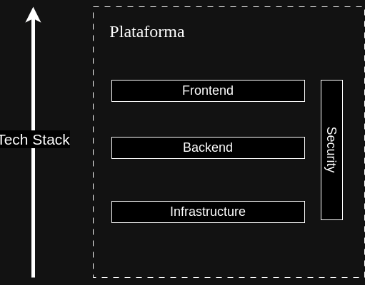
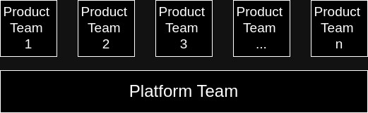

Na nossa [última conversa](https://giovane.boaviagemribeiro.com/blog/devex-1/), mostramos a evolução dos times de desenvolvimento ao longo dos anos, como o conceito de DevEx foi nascendo e que a Engenharia de Plataforma seria uma forma de resolver os problemas relacionados com as novas dinâmicas dos times de desenvolvimento. Agora, estamos prontos para avançar no nosso papo respondendo a questão: certo, mas o que é Engenharia de Plataforma e como implantar esse troço?

## O que é?

Primeiro, é necessário reforçar um ponto muito importante: a diferença entre PLATAFORMA e PRODUTO. **Plataforma** é um grande conjunto de softwares, APIs, bibliotecas e infraestruturas que são a base para a construção dos **produtos** que serão ofertados aos usuários. Plataformas são tradicionalmente estáveis, e não estão presentes em grande quantidade. Já os produtos, podem ser um pouco instáveis no lançamento (até pela natureza dinâmica), e buscando a estabilidade com o tempo, se forem bem aceitos pelo mercado e podem existir em grande quantidade. Essa diferença é importante de ser ressaltada principalmente porque ela reflete na composição dos times que vão trabalhar em produtos e plataformas:

- **Times de plataforma**: Por serem bem mais estáveis que os produtos, e com uma certa complexidade, os membros dos times de plataforma são os experts tecnicamente. Conhecem muito dos requisitos, fluxos e regras da aplicação[1]. Possuem uma missão técnica e seus clientes são internos, justamente os desenvolvedores dos produtos. Normalmente, a quantidade de membros dos times de plataforma são minoria em relação aos times de produto.
- **Times de produto**: Aqui a missão é diferente. Os integrantes dos times de produto possuem uma missão de negócio, são a maioria dos profissionais da organização e seus clientes são externos. A composição de cada time é dinâmica, pode ser alterada ao longo do tempo.

Como você já deve ter percebido, temos alguns desafios. As plataformas precisam estar disponíveis de uma forma que os times de produto consigam focar apenas nas regras de negócio, com as integrações, conexões e quaisquer fluxos que os devs precisem sejam otimizados para produtividade. Além disso, os devs não podem se preocupar com elementos como infraestrutura, ambiente de desenvolvimento, esteiras CI/CD, etc. Tudo isso precisa estar disponível para que os times de produto consigam focar apenas nisso: no produto. Ou seja: precisamos criar um "caminho dourado" para que os gargalos no ciclo de desenvolvimento das aplicações sejam mínimos. E tudo isso precisa estar englobado em práticas, processos, procedimentos, softwares, etc. Este conjunto de elementos que permitem a disponibilização de plataformas como produto interno para os desenvolvedores de produtos que são ofertados para os clientes finais é chamado de Engenharia de Plataforma (_Platform Engineering_).

## Como?

Para criar uma boa plataforma para desenvolvimento de produtos (sinônimo de _Internal Developer Platform_, ou IDP), é necessário que todo o ciclo de vida de um desenvolvimento de software seja cumprido de maneira simples, automática (onde for possível), e que todos os seus desenvolvedores amem usar (sim, a palavra é essa mesmo). Afinal de contas, os devs são os clientes dos times de plataforma e você precisa criar algo que seus clientes gostem e queiram usar, não é verdade?

E caso você esteja curioso para saber que "ciclo de vida" é esse, saiba que ele não mudou muito nos últimos 30 anos. É composto das seguintes fases, separadas aqui de maneira didática:

- **BUILD**: Onde você cria a aplicação e todos os seus módulos/componentes (front, back, IaC, configurações, scripts, etc)
- **SHIP**: Contém todas as automações necessárias para empacotamento e versionamento das aplicações (CI/CD, políticas de versionamento, geração de documentação externa, etc)
- **RUN**: Aqui estão todas as ferramentas, automações, scripts necessários para acompanhar a execução da aplicação (Observabilidade, monitoramento, segurança, suporte operacional, etc)

Lembre-se que o objetivo é cada vez mais empoderar os desenvolvedores, de modo a que o time tenha controle total do ciclo de vida do software "de ponta a ponta", mantendo a máxima "_you build it - you run it_".

A engenharia de plataforma não começou de hoje. Os primeiros anúncios sobre empresas que fizeram seus próprios IDPs remontam ao início dos anos 2010[2], apesar do termo "engenharia de plataforma" ainda não existir oficialmente. A ideia era simplesmente evoluir as práticas de DevOps para uma centralização e empoderamento maiores nos devs. O lançamento de livros como _Team Topologies_[3], reforçou a importância de existirem equipes cada vez mais integradas e misturadas, reduzindo os chamados "silos" e confirmando a tendência de centralização no desenvolvedor e consolidando conceitos como times de plataforma e produtos. Atualmente, temos diversas ferramentas terceirizadas[4][5] que permitem a criação e implantação de um IDP de forma mais prática, evitando que você reinvente a roda (cuidado com a síndrome "_This Should Be Easy_"[6]!) tornando assim a transição de práticas DevOps para Engenharia de Plataforma mais fluida.

## Quando?

Mas, você pode estar se perguntando: eu devo mesmo aplicar engenharia de plataforma na minha empresa, criar meu IDP e assim alcançar a felicidade? E a resposta, é: depende[7]. Em startups, é bastante comum que à medida em que a quantidade de pessoas aumente, o que era um único time passa a se multiplicar em vários, sempre respeitando algumas regras[8]. E com isso, surgem hierarquias, burocracias, a necessidade de processos, auditorias, etc. Em um contexto onde temos uma grande quantidade de times, a engenharia de plataforma, e principalmente os times de plataforma podem atuar como times de barramento (já que os profissionais mais seniors estão nestes times), ajudando a disseminar e manter os processos e práticas da organização, ao mesmo tempo que mantém a IDP funcionando.

Um outro critério para se determinar a adoção de Engenharia de Plataforma é o nível de maturidade da sua equipe. Uma IDP exige um alto conhecimento não só em desenvolvimento de software, mas em ferramentas que fazem parte das etapas do ciclo de vida e também dos processos, regras de negócio e práticas da organização. Além disso, a equipe precisa estar bastante sólida, com propósitos bem definidos e seus membros bem alinhados. Se você ainda não possui um time maduro em práticas devops, com processos de desenvolvimento bem definidos, melhor amadurecer um pouco mais essas práticas antes de construir o seu IDP.

### Referências

- [1] [https://medium.com/@chussenot/leading-platform-engineering-teams-aa9818be39d3](https://medium.com/@chussenot/leading-platform-engineering-teams-aa9818be39d3)
- [2] [https://medium.com/agorapulse-stories/platform-engineering-part-2-what-are-the-goals-of-a-platform-engineering-team-29aa439dae7d](https://medium.com/agorapulse-stories/platform-engineering-part-2-what-are-the-goals-of-a-platform-engineering-team-29aa439dae7d)
- [3] [https://teamtopologies.com/](https://teamtopologies.com/)
- [4] [https://medium.com/contino-engineering/creating-your-internal-developer-platform-part-2-65ff217cecd6](https://medium.com/contino-engineering/creating-your-internal-developer-platform-part-2-65ff217cecd6)
- [5] [https://platformengineering.org/platform-tooling](https://platformengineering.org/platform-tooling)
- [6] [https://leaddev.com/technical-best-practices/how-estimate-and-communicate-timelines-when-building-software](https://leaddev.com/technical-best-practices/how-estimate-and-communicate-timelines-when-building-software)
- [7] [https://medium.com/agorapulse-stories/platform-engineering-part-3-when-how-to-build-an-internal-developer-platform-cfb22efcca34](https://medium.com/agorapulse-stories/platform-engineering-part-3-when-how-to-build-an-internal-developer-platform-cfb22efcca34)
- [8] [https://docs.aws.amazon.com/whitepapers/latest/introduction-devops-aws/communication-collaboration.html](https://docs.aws.amazon.com/whitepapers/latest/introduction-devops-aws/communication-collaboration.html)
